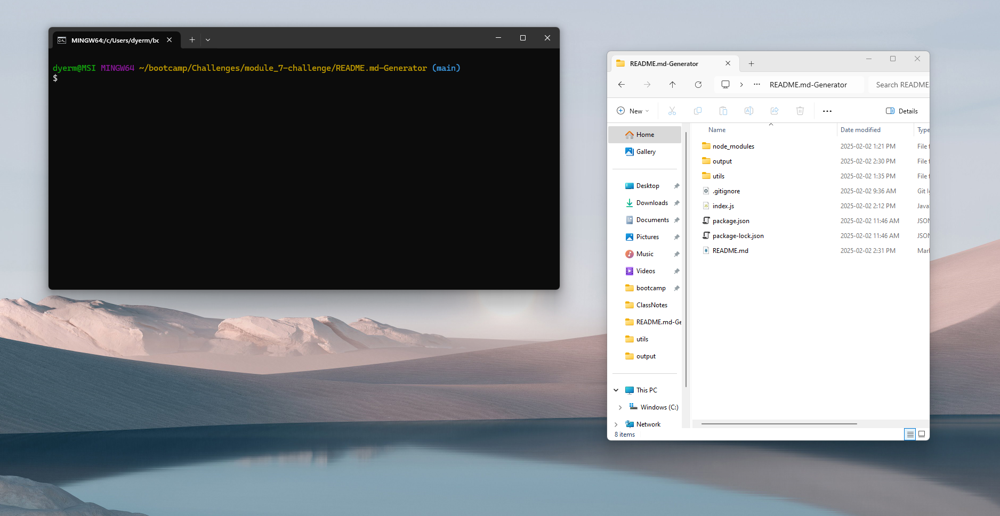
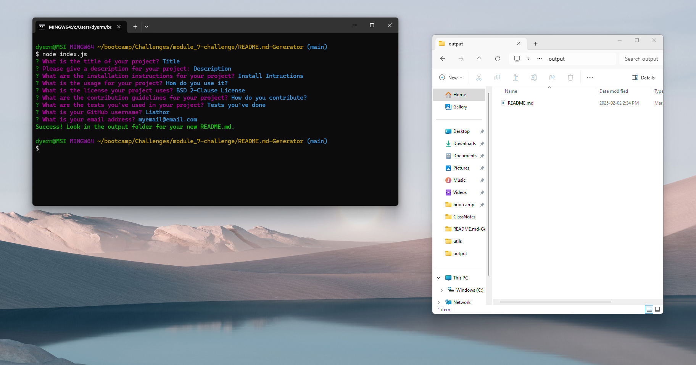
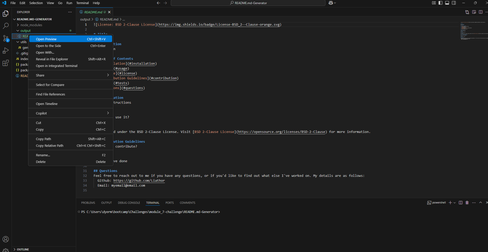

# README Generator

## Description
This application generates a README.md file for use in a GitHub Repo by means of terminal commands.

## Table Of Contents
1. [Installation](#installation)
2. [Usage](#usage)
3. [License](#license)
4. [Contribution Guidelines](#contribution)
5. [Tests](#tests)
6. [Questions](#questions)

## Installation
Download the files to your computer. Open a terminal console and make sure you are navigated to the folder containing index.js. From there run 'node index.js' and follow the prompts that appear.

## Usage
This project is used to help create a basic README.md file which contains all the essential elements. For a video walkthrough of how to use it, follow the video at the following link:  
https://watch.screencastify.com/v/3ZSQiwVnhweXGWOVKnk0

Or refer to the following steps:
1. Open terminal and have the address of the index.js file ready, navigate to the address in your terminal:

2. Run **node index.js** in your terminal, and follow steps given.

3. The outputed README.md file is located in the output folder. You can open and preview it in Visual Studio Code.

## License
Distributed under the MIT. Visit [MIT](https://opensource.org/licenses/MIT) for more information.

## Contribution Guidelines
None currently

## Tests
This project has been tested across a variety of licenses as of 2025-02-02

## Questions
Feel free to reach out to me if you have any questions, or if you'd like to find out what else I've worked on. My details are as follows:  
  Github: https://github.com/Liathor  
  Email: dyermisha@gmail.com  
